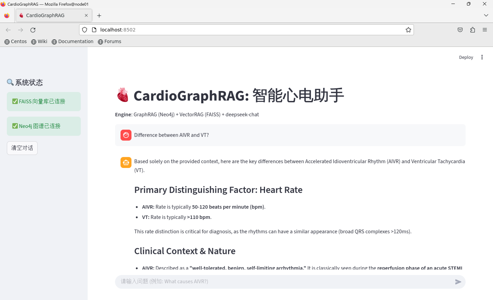
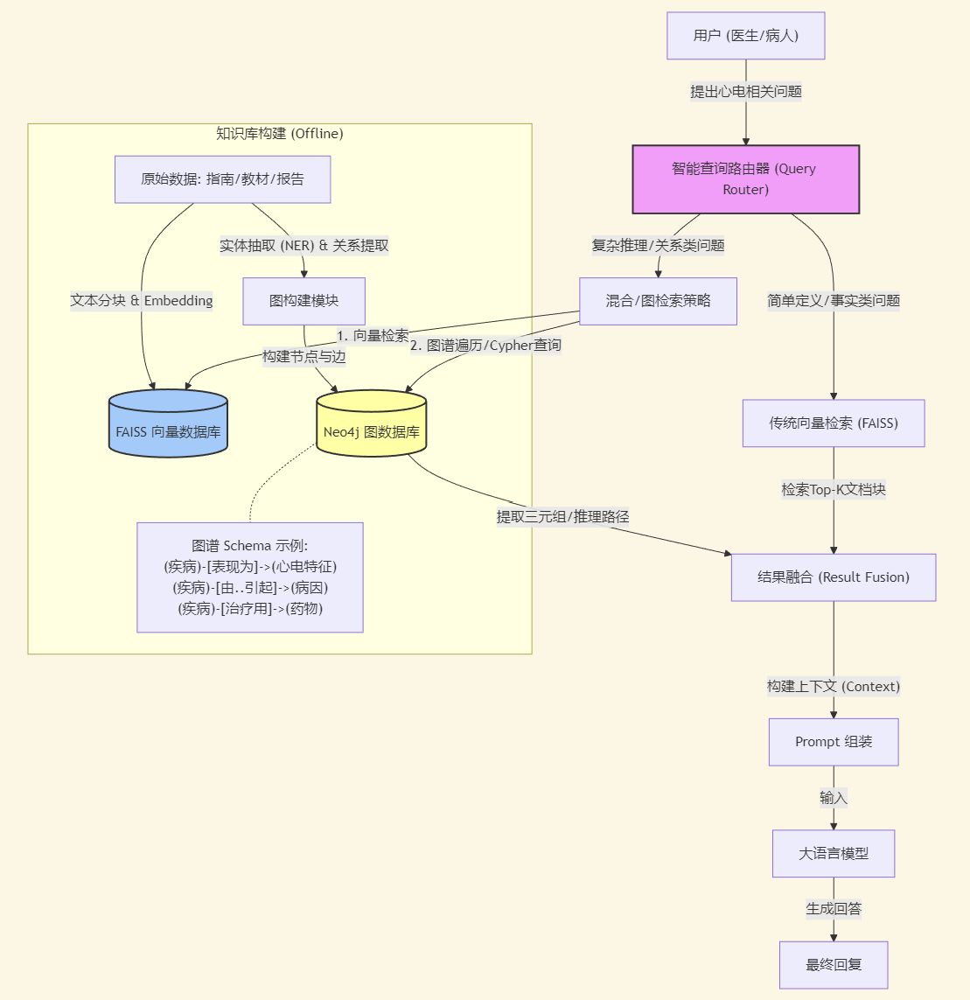

# 🫀 ECG-GraphRAG-Fusion: 基于知识图谱的心电诊断推理系统

<div align="center">

[](https://www.python.org/)
[](https://neo4j.com/)
[](https://github.com/facebookresearch/faiss)
[](https://www.deepseek.com/)
[](https://streamlit.io/)

[**项目演示**](#-系统演示) | [**技术文档**](docs/Technical_Report.md) | [**快速开始**](#-快速开始)

</div>

---

## 📖 项目介绍

**ECG-GraphRAG-Fusion** 是一个垂直领域的医学智能问答系统，旨在解决传统 RAG 在处理复杂医学逻辑时的局限性。

不同于仅依赖文本相似度的传统检索，本项目引入了 **知识图谱 (Knowledge Graph)** 技术，构建了一个包含心电特征、疾病、药物和解剖关系的结构化知识网络。通过 **混合检索策略 (Hybrid Retrieval)**，系统不仅能回答"什么是AIVR"等定义类问题，更能通过图谱推理回答"AIVR与心肌梗死有何因果关系"等复杂的临床推理问题。

### 🚀 核心特性

* **🕸️ 图谱增强 (Graph-Enhanced):** 利用 Neo4j 存储医学实体关系，支持多跳推理 (Multi-hop Reasoning)。
* **🧠 智能路由 (Intent Routing):** 基于 LLM 自动判断用户意图，动态选择“向量检索”或“图谱推理”模式。
* **⚖️ 混合检索 (Hybrid Search):** 融合 FAISS (向量) 的广度与 Neo4j (图谱) 的深度，大幅降低大模型幻觉。
* **🧬 自动知识抽取:** 内置 ETL 管道，可利用 LLM 从非结构化医学指南中自动构建知识图谱。

## 📺 系统演示

### 1. 复杂逻辑推理演示
> **用户提问**: *"What causes AIVR and how is it related to MI?"* (AIVR的成因是什么？它与心肌梗死有什么关系？)


点击下载或观看完整演示视频：[ECGGraphRAG.mp4](assets/ECGGraphRAG.mp4)
*(演示：系统通过 Router 识别意图，调用图谱发现 "AIVR --[TREATED_WITH]--> Restore perfusion"，从而推断出其与 MI 再灌注的关联)*

### 2. 系统架构图


## 🛠️ 技术栈

* **LLM Backend**: DeepSeek-Chat / DeepSeek-Reasoner
* **Graph Database**: Neo4j (存储实体关系)
* **Vector Database**: FAISS (存储文本切片)
* **Framework**: LangChain, Streamlit
* **Embedding**: BAAI/bge-small-en-v1.5

## 🏃 快速开始

### 前置要求
* Python 3.8+
* Neo4j (Docker 或 Desktop 版本均可)
* API Key (DeepSeek/OpenAI)

### 安装步骤

1.  **克隆仓库**
    ```bash
    git clone [https://github.com/Willowwyy/ECG-GraphRAG-Fusion.git](https://github.com/Willowwyy/ECG-GraphRAG-Fusion.git)
    cd ECG-GraphRAG-Fusion
    ```

2.  **安装依赖**
    ```bash
    pip install -r requirements.txt
    ```

3.  **配置环境**
    复制 `.env.example` 为 `.env` 并填入你的配置：
    ```env
    LLM_API_KEY="sk-..."
    NEO4J_URI="bolt://localhost:7687"
    NEO4J_PASSWORD="your_password"
    ```

4.  **构建知识库 (ETL)**
    ```bash
    # 1. 构建向量索引
    python src/rag_modules/vector_builder.py
    # 2. 提取图谱并导入 Neo4j
    python src/rag_modules/graph_builder.py
    python src/rag_modules/graph_importer.py
    ```

5.  **启动应用**
    ```bash
    streamlit run src/app.py
    ```

## 📄 许可证
MIT License
